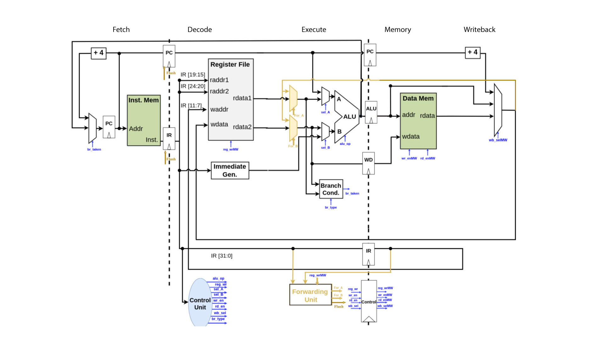

# RISC-V 3 Stage Pipelined in SystemVerilog
The project is 3 stage pipelined RISC-V processor in SystemVerilog. 

## Compilation

RTL can be compiled with the command: 

``` 
vlog names_of_all_system_verilog_files
```

or simply:  

``` 
vlog *.sv 
```

Compilation creates a ``` work ``` folder in your current working directory in which all the files generated after compilation are stored.
 
## Simulation

The compiled RTL can be simulated with command:

``` 
vsim -c name_of_toplevel_module -do "run -all"
```

Simulation creates a ``` .vcd ``` file. This files contains all the simulation behaviour of design.

## Viewing the VCD Waveform File

To view the waveform of the design run the command:

```
gtkwave dumfile_name.vcd
```

This opens a waveform window. Pull the required signals in the waveform and verify the behaviour of the design.

## Design Diagram


## Explanation

### Stage-1: Fetch
`pc.sv`, `inst_mem.sv` and muxes are used in this stage. It's output is being stored in buffers.
### Stage-2: Decode and Execute
`reg_file.sv`, `imm_gen.sv`, `alu.sv`, `branch_cond.sv` and muxes are used in this stage. The output of buffers from the fetch stage is used as input in this stage and this stage's output is being stored in the next buffers.
### Stage-3: Memory and Writeback
`data_mem.sv` and `sel_wb_mux` are used in this stage. The `waddr` of register file is taken from the buffers at this stage.
